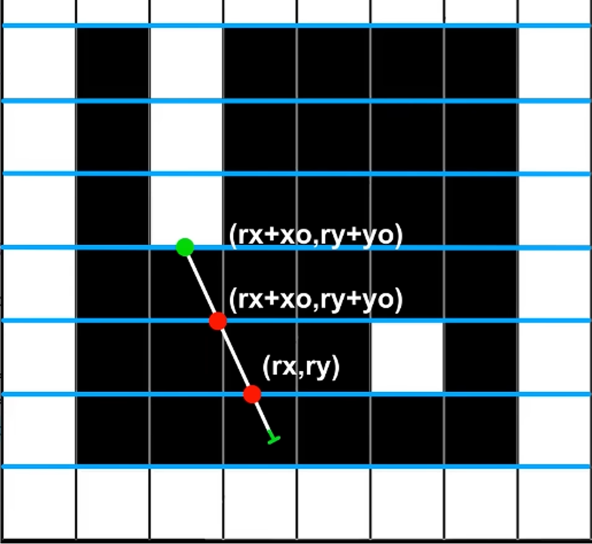

## Constant

- Game Resolution: 160x120
    - FrameBufferSize = 230400 = 230k bits
- Color: RGB444
- Pixel Coord:
    - unsigned 10 bit
    ```
    +------> x
    |
    |
    V y
    ```
- World Coord: 
    - unsigned 10 bit
    ```
    ^ y (0-1023)
    |
    |
    +--------> x (0 ~ 1023)
    ```
- Map
    - Tile: 8x8
    - Tile Width = (1024 / 8) = 128
- Radian : [0, 2*PI) <--> [0, 1024)
    ```c
    `define ANGLE_0     10'd0      // 0°
    `define ANGLE_90    10'd256    // 90° = π/2
    `define ANGLE_180   10'd512    // 180° = π
    `define ANGLE_270   10'd768    // 270° = 3π/2
    ```
- FOV
    ```
    // 视野 (Field of View)
    `define FOV_60      10'd171    // 60° ≈ 1024 * 60/360
    `define FOV_90      10'd256    // 90°
    `define FOV_120     10'd341    // 120°
    ```

- Timing:
    - 100 MHz
    - 60 FPS
    - ClockPerFrame: 1e8/60 = 1.66e6 clk
    - ColumnPerFrame = ClockPerFrame/Width = 10375 clk

## Data Type

- World Position: 16 bit unsigned integer
- Angle: 10 bit unsigned integer
- Sin/Cos/Tan/Cot : Q9.7 signed fixed-point
    - according to Cot/Tan scope, under 10 bit Angle
- Pixel Coord : 10 bit unsigned integer

## Modules

- module PlayerController
    ```c
    in:
        clk, rst
        keyboard_io
    out:
        bus(WIDTH_POS * 2) player_pos
        bus(WIDTH_ANG * 2) player_dir
    ```

- module Raycaster
    ```c
    in: inx, iny, ina, clk
    out: u, v, color
    ```
    - Pre Calculate
        ```c
        in: px, py, ra
        out: vrx, vry, vxo, vyo, vskip
             hrx, hry, hxo, hyo, hskip

        tan = ...
        div_tan = ... // cot

        // look exactly up or down
        vskip = (ra == 90 || ra == 270)? 1 : 0
        vrx = (ra < 90 || ra > 270)? ceil_to_tile(px) : floor_to_tile(px)
        vry = py + tan * (vrx - px) // dy = tan * dx
        vox = TILE_WIDTH
        voy = TILE_WIDTH * tan

        hskip = (ra == 0 || ra == 180)? 1 : 0
        hry = (ra > 0 && ra < 180)?  ceil_to_tile(py) : floor_to_tile(px)
        hrx = px + (hry - py) * div_tan;
        hoy = TILE_WIDTH;
        hox = TILE_WIDTH * div_tan;
        ```
    - 
    - FSM
        ```mermaid
        stateDiagram-v2

        DRAW_COL: DRAW_COL
        DRAW_COL : / output px_x, px_y, color

        [*] --> IDLE

        IDLE --> PRECALC : frame_start == 1 <br> / **x, y, a <= in_signal**

        PRECALC --> VER_DDA : done == 1  / <br> **rx, ry, xo, yo <= ...**

        VER_DDA --> VER_DDA : hit == 0 / <br> **rx, ry <= rx+ox, ry+yo**
        VER_DDA --> HOR_DDA : hit == 1 <br> / **rx, ry <= reset** <br> / **vdis <= ...**

        HOR_DDA --> HOR_DDA : hit == 0 / <br> **rx, ry <= rx+ox, ry+yo**
        HOR_DDA --> CALC_HEIGHT : hit == 1 / <br> **px_y <= 0** / <br> **hdis <= ...**

        CALC_HEIGHT --> DRAW_COL : done / **height <= ...**

        DRAW_COL --> DRAW_COL : px_done == 1 / <br> **px_y <= ...**
        DRAW_COL --> NEXT_COL : col_done == 1 /

        NEXT_COL --> PRECALC : frame_done == 0 / <br> **a <= ...**
        NEXT_COL --> IDLE : frame_done == 1
        ```

- module TrigLUT (三角函数查找表)
    ```verilog
    input  wire [9:0] in_angle,     // 角度输入 [0, 1024)
    output wire [WIDTH_TRIG-1:0] out_sin,
    output wire [WIDTH_TRIG-1:0] out_cos,
    output wire [WIDTH_TRIG-1:0] out_tan,
    output wire [WIDTH_TRIG-1:0] out_atan  // -1/tan(angle)
    ```

    - 参数
        ```verilog
        parameter WIDTH_TRIG = 20;  // 定点数位宽
        parameter FRAC_BITS = 16;   // 小数位数 (Q4.16 格式)
        // 表示范围: [-8, 8), 精度: 1/65536 ≈ 0.000015
        ```

    - 实现方式
        ```
        1. ROM 查找表，存储 1024 个预计算值
        2. 使用 signed fixed-point Q4.16 格式:
           - 整数部分: 4 位 (范围 -8 ~ 7.99)
           - 小数部分: 16 位 (精度 2^-16)
        3. 存储内容:
           - sin: 范围 [-1, 1]
           - cos: 范围 [-1, 1]
           - tan: 范围 [-∞, ∞], 需要 clamp 到 [-8, 8]
           - atan: -1/tan, 需要特殊处理 tan=0 的情况
        ```

    - 特殊值处理
        ```c
        // tan 和 atan 在特定角度需要特殊处理
        if (angle == ANGLE_90 || angle == ANGLE_270)
            tan = LARGE_VALUE;   // ±∞ 用大数表示
            atan = 0;

        if (angle == ANGLE_0 || angle == ANGLE_180)
            tan = 0;
            atan = LARGE_VALUE;  // ±∞ 用大数表示
        ```
    - 时序
        ```
        组合逻辑输出 (纯 ROM 读取)
        延迟: 1 个时钟周期
        ```
